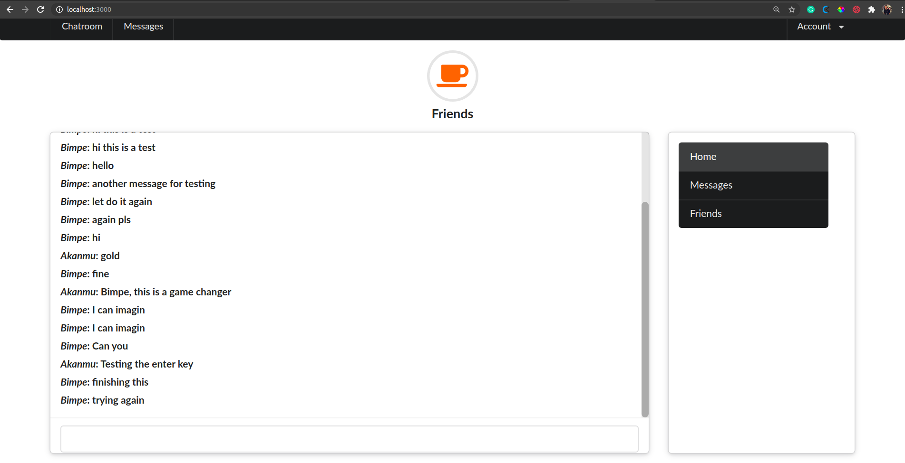

# Insta Chat App

This rails project is a message app that allow users send message in real time.

<!-- PROJECT SHIELDS -->
<!--
*** I'm using markdown "reference style" links for readability.
*** Reference links are enclosed in brackets [ ] instead of parentheses ( ).
*** See the bottom of this document for the declaration of the reference variables
*** for contributors-url, forks-url, etc. This is an optional, concise syntax you may use.
*** https://www.markdownguide.org/basic-syntax/#reference-style-links
-->

[![Contributors][contributors-shield]][contributors-url]
[![Forks][forks-shield]][forks-url]
[![Stargazers][stars-shield]][stars-url]
[![Issues][issues-shield]][issues-url]

<!-- PROJECT LOGO -->
 

  <h3 align="center">Building form with Ruby on Rails</h3>

  

    This project is part of the Microverse curriculum in Ruby on Rails module!
     
     
    <a href="https://github.com/jstloyal/insta-message"><strong>Explore the docs »</strong></a>
     
     
    <a href="https://github.com/jstloyal/insta-message/issues">Report Bug</a>
    <a href="https://github.com/jstloyal/insta-message/issues">Request Feature</a>
  

<!-- TABLE OF CONTENTS -->

## Table of Contents

- [About the Project](#about-the-project)
- [Contributors](#contributors)
- [Live Version](#live-version)
- [Acknowledgements](#acknowledgements)
- [License](#license)

<!-- ABOUT THE PROJECT -->

## About The Project

Rails app for instant messages in real time:

- Sign up new users
- Login users
- Belong to the chatroom once you've signed in
- Send message and able to respond to other users messages

## Contributing

Contributions, issues and feature requests are welcome! Start by:

- Forking the project
- Cloning the project to your local machine
- `cd` into the project directory
- Run `git checkout -b your-branch-name`
- Make your contributions
- Push your branch up to your forked repository
- Open a Pull Request with a detailed description to the development branch of the original project for a review

### Built With

This project was built using these technologies.

- Ruby on Rails
- JavaScript
- HTML/CSS
- Atom editor
- Git-Flow

### How to use

- \$bundle install

- \$rails db:migrate

- \$rails db:seed

- \$rails server

- Go to http://localhost:3000/ in your web browser

## Contributors

**Author1**

​## Adetayo Sunkanmi

- Github: [@jstloyal](https://github.com/jstloyal)
- Twitter: [@jstloyalty](https://twitter.com/jstloyalty)
- Linkedin: [Adetayo Sunkanmi](https://www.linkedin.com/in/jstloyalty)
- E-mail: jstloyalty@gmail.com

<!-- ACKNOWLEDGEMENTS -->

## Acknowledgements

- [Google](https://www.google.com/)
- [Udemy Rails course](https://www.udemy.com/)
-

<!-- MARKDOWN LINKS & IMAGES -->
<!-- https://www.markdownguide.org/basic-syntax/#reference-style-links -->

[contributors-shield]: https://img.shields.io/github/contributors/jstloyal/insta-message.svg?style=flat-square
[contributors-url]: https://github.com/jstloyal/insta-message/graphs/contributors
[forks-shield]: https://img.shields.io/github/forks/jstloyal/insta-message.svg?style=flat-square
[forks-url]: https://github.com/jstloyal/insta-message/network/members
[stars-shield]: https://img.shields.io/github/stars/jstloyal/insta-message.svg?style=flat-square
[stars-url]: https://github.com/jstloyal/insta-message/stargazers
[issues-shield]: https://img.shields.io/github/issues/jstloyal/insta-message.svg?style=flat-square
[issues-url]: https://github.com/jstloyal/insta-message/issues

<!-- LICENSE -->

## License

📝
This project is [MIT](https://opensource.org/licenses/MIT) licensed.
